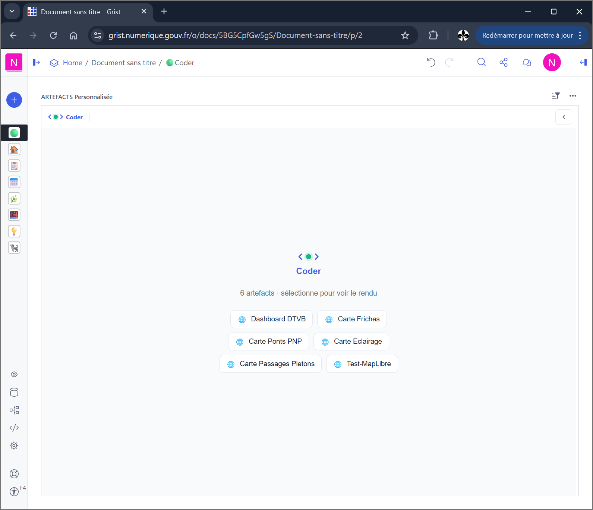
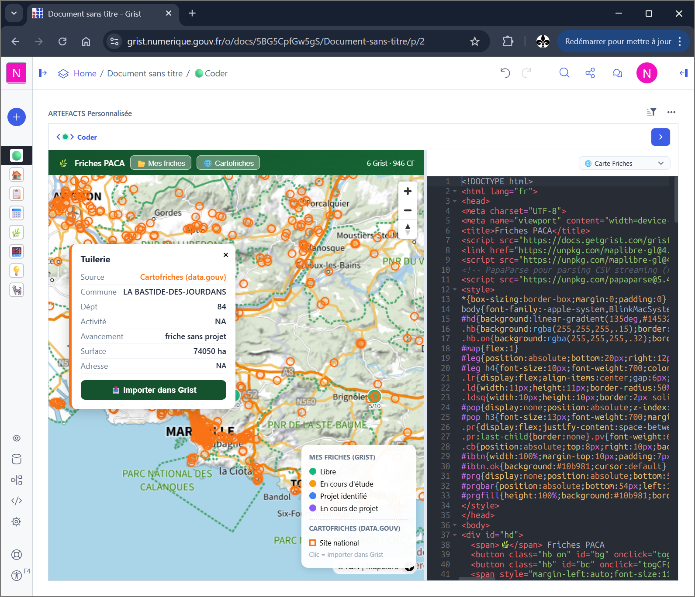

# GristCoderMCP — MCP Server for Grist

> Turn any Grist document into a full business application using AI.

**Grist Coder** is an [MCP](https://modelcontextprotocol.io/) server that connects Claude (or any MCP-compatible LLM) to a [Grist](https://www.getgrist.com/) document. It ships with a **custom widget** (IDE + live preview) that lets you build, edit, and deploy HTML/React artefacts — all stored inside your Grist document, no external hosting needed.


> **Project status**: This is an experimental, work-in-progress project developed at [Cerema Méditerranée](https://www.cerema.fr/). It works reliably for a single user on localhost, but several features (wizard, sub-agents, chat) are in beta. We publish it to share the approach, gather feedback from the Grist community, and invite contributions toward a complete Grist Coder.

| Widget home — artefact selector | Map artefact + code editor |
|:---:|:---:|
|  |  |

---

## What it does

| You say to Claude | What happens |
|---|---|
| *"Create a CRM for my contacts"* | Tables, columns, sample data, a React dashboard, and Grist pages — all wired together |
| *"Add a chart showing sales by month"* | An HTML artefact with Chart.js, linked to your data via the Grist bridge |
| *"Set up a webhook to notify Slack when a deal closes"* | A Grist webhook pointing to your Slack endpoint |
| *"Fix the filter on the inventory page"* | Reads the artefact code, patches it, live-previews the result |
| *"Ship it"* | Freezes the artefact into the document as a standalone widget — npm imports bundled, no dependency on this server, it keeps working if the server stops and travels with the document |

Everything lives inside the Grist document. The artefacts (HTML/React widgets) are stored in an `Artefacts` table and rendered by the custom widget. Users interact with the finished app — they never see the AI or the code.

---

## Architecture

### The 4-layer model

Grist Coder sees a Grist document as a **4-layer application**:

```
Layer          Built with                       What it is
─────────────  ───────────────────────────────  ──────────────────────────────
1. Data        Grist tables + column formulas   The structured information
2. UI          HTML/React artefacts + pages     What users see and interact with
3. Logic       grist_apply, grist_sql, upsert   What the system does on actions
4. Integration grist_webhooks → external APIs   What the document triggers outside
```

### Contextual navigation — progressive tool disclosure

The server does **not** expose all 34 tools at once. Instead, it tracks a **session context** that evolves through 6 phases:

```
qualifying → assessing → designing → building → verifying → done
```

At each phase, only the relevant tools are visible to the LLM client:

| Phase | Tools available | Purpose |
|-------|----------------|---------|
| **qualifying** (15 tools) | sessions, wizard, plan, grist read, subagent, chat | Understand what the user needs |
| **assessing** (19 tools) | + canvas_read, screenshot, views_list | Audit the existing document |
| **designing** (22 tools) | + canvas_write, canvas_patch, canvas_type | Prototype the UI |
| **building** (34 tools) | All tools | Full construction |
| **verifying** (34 tools) | All tools | Quality check |
| **done** (17 tools) | = qualifying | Delivered, ready for next project |

Phase transitions are triggered by `plan_update(status=...)` which:
1. Updates the session context
2. Pushes a `notifications/tools/list_changed` MCP notification to the client
3. The client re-fetches the tool list and sees the new set

This prevents the LLM from jumping ahead (e.g., writing code before understanding the schema) and reduces token waste from unused tool descriptions.

### Contextual MCP resources

Resources are also organized by phase. Each tool response includes a `_next` hint and `_next_resources` pointing to what the LLM should read next:

```
Phase         Recommended resources
────────────  ──────────────────────────────────────────────────
qualifying    docs/qualification, docs/wizard
assessing     context/{token}, docs/schema, schema-diagram/{token}
designing     docs/schema, docs/artefacts, docs/playbook
building      context/{token}, docs/artefacts, docs/formulas, playbook/{scenario}
verifying     context/{token}, code/{token}
```

The `context/{token}` resource is a live snapshot that includes: full schema, FK relationship graph, artefact list, page/section layout, quality audit (`_quality`: missing visibleCol, empty widgets, orphan tables), and delta between plan and reality (`_delta`).

---

## The Widget — Grist Custom Widget

The widget (`widget.html`) is a split-pane IDE served at `/`:

```
┌──────────────────────────────────────────────┐
│  Navbar: ‹ ● › Coder          [panel toggle] │
├────────────────────────┬─────────────────────┤
│                        │ Edit bar: [artSelect]│
│   Preview (iframe)     │ Ace editor           │
│   Live render of the   │ Syntax-highlighted   │
│   selected artefact    │ source code          │
│                        │                      │
├────────────────────────┴─────────────────────┤
│  Wizard overlay (when active)                 │
│  ┌─────────────────────────────────────────┐ │
│  │ Multi-card thread: progress, forms,     │ │
│  │ choices, confirmations — all coexist    │ │
│  ├─────────────────────────────────────────┤ │
│  │ Chat bar (appears when LLM sends chat)  │ │
│  └─────────────────────────────────────────┘ │
└──────────────────────────────────────────────┘
```

Key features:
- **Artefact selector**: dropdown to switch between artefacts stored in Grist
- **Live preview**: sandboxed iframe with auto-injected Grist bridge (`grist.docApi.*`, `grist.onRecord()`)
- **Auto-save**: edits in Ace are saved back to Grist via browser-side `applyUserActions` (bypasses server-side WAF)
- **SSE sync**: canvas changes from the LLM (via `canvas_write`/`canvas_patch`) push to the widget in real-time

---

## Wizard — Interactive AI ↔ User dialogue (beta)

The wizard is an overlay system that lets the LLM interact with the user **directly through the widget**, without requiring the user to type in the LLM chat interface.

### How it works

1. The LLM calls `canvas_wizard(step)` with a step definition
2. The server pushes the step via SSE to the widget
3. The widget renders an interactive card (form, choice, confirmation...)
4. The user responds in the widget
5. The response is sent back to the server via `POST /wizard/{token}`
6. The `canvas_wizard` tool call unblocks and returns the user's answer to the LLM

### Card types

| Type | Behavior | Use case |
|------|----------|----------|
| `input` | Blocking | Free-text collection with suggestion chips |
| `choice` | Blocking | Category selection (clickable cards) |
| `form` | Blocking | Structured data collection (text, number, select, toggle) |
| `confirm` | Blocking | Markdown preview + accept/reject |
| `progress` | Non-blocking | Build progress with status indicators |
| `info` | Non-blocking | Contextual information |
| `preview` | Blocking | Live iframe preview + interaction |
| `data-import` | Blocking | Fetch external API → preview table → import to Grist |

### Multi-card thread

Multiple cards coexist in the overlay — a non-blocking progress card can stay visible while a blocking form card collects input. Cards are managed independently:
- `canvas_wizard(id="build-progress", type="progress", ...)` — persistent progress tracker
- `canvas_wizard(id="confirm-plan", type="confirm", ...)` — blocking validation
- `canvas_wizard_close(card_id="confirm-plan")` — close one card
- `canvas_wizard_close()` — close everything

### Current limitations (beta)

- The wizard UX is functional but rough — styling and transitions need polish
- Card layout on mobile/small viewports is not optimized
- The `data-import` card type works but error handling is minimal
- Chat integration (`chat_reply` / `wait_for_chat`) is basic — no message history persistence
- Sub-agent delegation (`subagent_call`) depends on MCP client sampling support; fallback mode works but is less reliable

---

## Quick start

### Option A — Python (development)

```bash
git clone https://gitlab.cerema.fr/mcp/gristcoder_mcp.git
cd grist-coder-mcp

python -m venv .venv
# Windows
.venv\Scripts\activate
# macOS/Linux
source .venv/bin/activate

pip install -r requirements.txt
cp .env.example .env        # edit HOST_URL if needed
uvicorn grist_coder:app --port 8742 --reload
```

### Option B — Docker

```bash
git clone https://gitlab.cerema.fr/mcp/gristcoder_mcp.git
cd grist-coder-mcp

cp .env.example .env
docker compose up -d
```

### Verify

```bash
curl http://localhost:8742/health
# → {"ok": true, "version": "5.14", "tools": 34, ...}
```

---

## Setup

### 1. Add the widget to Grist

In your Grist document:
1. Add a new **Custom Widget**
2. Set the URL to `http://localhost:8742/`
3. Grant **Full document access** when prompted

The widget registers itself automatically — no API key needed on the widget side.

### 2. Connect Claude Desktop

Edit `%APPDATA%\Claude\claude_desktop_config.json` (Windows) or `~/Library/Application Support/Claude/claude_desktop_config.json` (macOS):

```json
{
  "mcpServers": {
    "grist-coder": {
      "type": "http",
      "url": "http://localhost:8742/mcp",
      "headers": {
        "Authorization": "Bearer YOUR_GRIST_API_KEY"
      }
    }
  }
}
```

Get your Grist API key from **Grist → Profile → API**.

Restart Claude Desktop after editing.

### 3. Connect Claude Code (CLI)

Copy `.mcp.json.example` to `.mcp.json` and fill in your Grist API key:

```bash
cp .mcp.json.example .mcp.json
# edit .mcp.json with your key
```

---

## MCP Tools (34)

### Sessions
| Tool | Description |
|------|-------------|
| `sessions_list` | List open Grist documents — **call first** |
| `session_open` | Open a document **without a browser**, from the caller's Grist key |
| `session_select` | Pin a default session for this connection |
| `session_info` | Full context: doc, tables, artefacts, canvas state |

> Every document-scoped tool also accepts an optional `token` argument. Routing is
> carried **per call**, not by shared server state — so several agents or browser
> tabs can work on different documents in parallel.

### Plan & context
| Tool | Description |
|------|-------------|
| `plan_update` | Update the work plan, transition phase, trigger tool list change |

### Canvas (artefact editor)
| Tool | Description |
|------|-------------|
| `canvas_select` | Switch to a different artefact (read-only) |
| `canvas_read` | Read the current artefact source code |
| `canvas_write` | Write/replace the full artefact code |
| `canvas_patch` | Surgical find-and-replace (`old_str` → `new_str`) |
| `canvas_exec` | Execute Python canvas (sandboxed subprocess, 10s timeout) |
| `canvas_screenshot` | Capture the rendered artefact as PNG |
| `canvas_type` | Change artefact type (html, react, markdown, mermaid, python, sql, svg...) |

### Interactive — wizard / chat (beta)
| Tool | Description |
|------|-------------|
| `canvas_wizard` | Show an interactive card in the widget (choice, form, confirm, progress...) |
| `canvas_wizard_close` | Close a specific card or the entire overlay |
| `canvas_context_update` | Non-blocking context card in the overlay |
| `chat_reply` | Send a chat message — optionally wait for user response |
| `wait_for_chat` | Wait for user input without sending |
| `subagent_call` | Delegate to a specialized sub-agent (data-architect, ui-designer...) |

### Artefact management
| Tool | Description |
|------|-------------|
| `artefact_init` | Create the `Artefacts` table if missing (idempotent) |
| `artefact_publish` | Freeze a finished HTML artefact as a **fully standalone widget stored inside the doc** (gallery "Custom widget builder") — no MCP server needed at runtime. Bundles npm imports automatically (esbuild), and refuses any artefact that would depend on the pod. `mode="app"` publishes a shell that lazily mounts the `app/…` rows as screens of a multi-screen application |

### Grist — Read
| Tool | Description |
|------|-------------|
| `grist_schema` | Document schema (tables, columns, types) |
| `grist_records` | Read records from a table (with optional filter/limit) |
| `grist_sql` | Run arbitrary SQL on the document |

### Grist — Write
| Tool | Description |
|------|-------------|
| `grist_records_add` | Insert new records |
| `grist_records_patch` | Update existing records by ID |
| `grist_upsert` | Upsert on a business key (`require` + `fields`) |
| `grist_apply` | Low-level Grist UserActions (AddTable, AddColumn, etc.) |

### Document / Pages
| Tool | Description |
|------|-------------|
| `grist_views_list` | List pages with their widget sections |
| `grist_view_create` | Create a page with a grid + optional artefact widget |
| `grist_view_add_widget` | Add a widget section to an existing page |
| `grist_section_configure` | Configure a custom widget section (artefact, linking...) |

### Webhooks
| Tool | Description |
|------|-------------|
| `grist_webhooks` | CRUD webhooks (list, create, update, delete) |

---

## HTTP Endpoints

| Method | Route | Purpose |
|--------|-------|---------|
| `POST` | `/mcp` | MCP JSON-RPC (tools, resources, prompts) |
| `GET` | `/mcp` | SSE stream — live canvas updates to widget |
| `DELETE` | `/mcp` | Close an SSE session |
| `POST` | `/register` | Widget auto-registration |
| `POST` | `/wizard/{token}` | Wizard form response from widget |
| `GET` | `/llm-config` | What the pod knows about the LLM (base, model, *whether* it holds a key — never the key itself) |
| `POST` | `/llm-proxy/{path}` | CORS-free relay to an allowlisted LLM host; injects the pod key when the browser sends none |
| `GET` | `/harness/{file}` | Browser-side agent modules |
| `POST` | `/webhook-receive/{docId}` | Grist webhook receiver → SSE fan-out (production, public URL required) |
| `GET` | `/` | Serves the custom widget |
| `GET` | `/health` | Health check |

---

## MCP Resources

Resources provide contextual documentation and live data to the LLM.

### Static documentation
| URI | Content |
|-----|---------|
| `grist-coder://docs/schema` | Column types, formulas, visibleCol recipes |
| `grist-coder://docs/artefacts` | Artefact templates, Grist bridge API, DSFR components |
| `grist-coder://docs/playbook` | Page creation sequences, linked sections, decision tree |
| `grist-coder://docs/app-patterns` | Multi-widget patterns: navigation, sync, routing |
| `grist-coder://docs/formulas` | Grist Python column formulas (isFormula, lookupOne...) |
| `grist-coder://docs/wizard` | Wizard card schema and types |
| `grist-coder://docs/qualification` | App categories, architecture templates, completeness criteria |
| `grist-coder://docs/services-geo` | Geocoding, maps (BAN, OSM, IGN, Leaflet) |
| `grist-coder://docs/services-data` | Open data (SIRENE, DVF, data.gouv, API Geo) |
| `grist-coder://docs/services-ai` | AI patterns (sync, async webhook, bridge, sub-agent) |

### Live document context (templates)
| URI | Content |
|-----|---------|
| `grist-coder://plan/{token}` | Persistent work plan + phase + `_next_step` hint |
| `grist-coder://context/{token}` | Full document snapshot: schema, FK graph, artefacts, pages, `_quality` audit, `_delta` plan vs reality |
| `grist-coder://schema-diagram/{token}` | Auto-generated Mermaid ER diagram |
| `grist-coder://code/{token}` | Source code of all artefacts |
| `grist-coder://context/{token}/page/{page_id}` | Page-level context: source table, linked sections, configured artefact |
| `grist-coder://playbook/{scenario}` | Scenario guide: `dashboard`, `fiche`, `table`, `full-app`, `master-detail` |
| `grist-coder://examples/{domain}` | Schema + sample data for: `crm`, `rh`, `stock`, `projets`, `immobilier`, `association`, `restaurant`, `formation` |

---

## How artefacts work

Artefacts are stored in a Grist table called `Artefacts`:

| Column | Purpose |
|--------|---------|
| `Nom` | Unique name (used as key) |
| `Type` | `html`, `react`, `app`, `markdown`, `mermaid`, `python`, `sql`, `svg` |
| `Code` | The source code |
| `Description` | What this artefact does |

The widget renders artefacts in a sandboxed iframe with an auto-injected **Grist bridge** — artefacts can call `grist.docApi.fetchTable()`, `grist.onRecord()`, etc. to read and write Grist data directly.

### Artefact types

| Type | Rendered as | Use case |
|------|------------|----------|
| `html` | Raw HTML in iframe | Dashboards, forms, custom UIs |
| `react` | React 18 + Babel (CDN) | Complex interactive components |
| `app` | React + multi-view router | Full single-page applications |
| `markdown` | Rendered Markdown | Documentation, reports |
| `mermaid` | Mermaid diagrams | Flowcharts, ER diagrams |
| `python` | Executed via `canvas_exec` | Data processing scripts |
| `sql` | Executed via `grist_sql` | Analytical queries |
| `svg` | Inline SVG | Icons, illustrations |

---

## Render diagnostics — the correction loop

An artefact that fails renders a blank page, and the agent that just wrote it
learns nothing. Without feedback it either declares success on broken code, or
needs a human to open the console.

A probe is injected into every rendered artefact — **before** the Grist bridge and
before the artefact's own code, so initialisation errors are caught too. It
reports back exceptions (message, line, column, first stack frames), unhandled
promise rejections, `console.error`, resources that failed to load, and **the
state of the render**: element count, text length, canvas/svg presence.

That last one matters most, and it is not obvious. An error is not required for an
artefact to be broken: a screen whose script fails early shows its markup and
nothing else, without throwing anything. A headless render would report "page
loaded, zero errors". Measuring what was *rendered*, not just what *crashed*,
catches it.

`canvas_write` waits briefly for the result and returns it in the same response:

```json
{
  "ok": true, "sha": "4d9f44f7",
  "diagnostic": {
    "erreurs": [{"message": "Uncaught ReferenceError: calculerTotal is not defined",
                 "ligne": 8, "colonne": 13, "pile": "..."}],
    "resume": "Artefact en echec au rendu : 1 exception(s)."
  },
  "_next": "Corriger puis reecrire — le diagnostic revient a chaque canvas_write."
}
```

The agent fixes and rewrites; the diagnostic disappears. No screenshot, no console,
no human in the loop.

Two limits. It needs **a widget open on that document** — nothing renders without a
browser, so there is nothing to observe. And it covers the **initial render**: an
error triggered by a later click is captured but no longer awaited — read it back
with `session_info`, which returns the last diagnostic.

---

## Publishing — standalone widgets

`artefact_publish` freezes an artefact into the document itself, in the section
options of a gallery widget. **The published widget does not depend on this server
at runtime**: it survives the pod being stopped and travels with the document
(copies, exports).

That promise is *verified*, not merely stated. Publication is refused when the
code references the pod — `/ai-proxy`, `/llm-proxy`, `/webhook-receive`, or the
pod's own URL — because such a widget would die with the server. Use
`grist_view_create` instead for artefacts meant to stay served by the pod.

**npm imports are bundled automatically.** An artefact doing
`import { render } from 'preact'` cannot run in a browser as-is — it would render
blank. On publish, the server resolves the imports with esbuild (a static Go
binary in the image, no Node) and inlines everything. Packages are fetched from
the npm registry on demand and cached. Transitive dependencies are resolved by
retrying on esbuild's own "Could not resolve" errors, which converges without
reimplementing npm.

JSX works inside a `html` artefact — the type check applies to `Artefacts.Type`,
not to the content.

**External CDNs still work** in a published widget (measured: a `<script src>`
pointing at jsDelivr does execute). They are reported, not blocked: the widget
then depends on that CDN at runtime and breaks if it becomes unreachable.
Bundling is therefore a robustness choice, not a technical necessity.

### `mode="app"` — a multi-screen application in one widget

Rows named `app/Accueil`, `app/Detail`… become **screens**. Publishing with
`mode="app"` installs a small shell that lists them, mounts one on demand, and
gives each screen `app.navigate()`, `app.emit()` / `app.on()`, `app.setState()`
plus the Grist API relayed over postMessage.

Two properties make this worth it. Section metadata stays tiny — Grist downloads
all `_grist_*` tables in full on every document open, so a monolithic artefact
costs that weight to everyone, every time. And screens are fetched **one SQL query
at a time**: a screen nobody visits is never downloaded.

Measured on a three-screen application against a monolithic artefact of comparable
content: 6.5 KB of section metadata instead of 755 KB, 237 bytes transferred at
open, and an unvisited screen never fetched.

Editing a screen needs no republication — change the row, reload the page.

---

## Browser-side agent (harness)

Everything above assumes an external MCP client — Claude Desktop, Claude Code — driving
the tools. The harness is the other way round: an LLM agent that runs **inside the widget**,
in the browser, and calls the same MCP tools over the same `/mcp` endpoint. The document
then builds itself from Grist alone, with no desktop client in the loop.

Seven vanilla-JS modules under `harness/`, served by the pod at `/harness/{file}`:

| Module | Role |
|--------|------|
| `boot.js` | Load order and wiring into the widget |
| `config-panel.js` | LLM configuration + the robot button in the navbar |
| `llm-client.js` | Transport to `/llm-proxy`, timeouts, scrubbed errors |
| `agent-loop.js` | The turn loop: prompt → tool calls → observations |
| `mcp-tools.js` | Tool discovery and invocation against `/mcp` |
| `agent-memory.js` | Conversation memory across turns |
| `render-bridge.js` | Who drives the render pane — `local` (agent) or `sse` (server) |

### Configuration comes from the pod

The LLM key used to live in the browser's `localStorage`, retyped on every machine.
It doesn't have to: the pod usually holds one already, and knows which base and model
to use. `GET /llm-config` reports that — **never the key itself**, only whether one
exists. The panel prefills base and model, and stops demanding a key when the pod can
supply it. When it can't, it says so plainly instead of refusing generically.

```bash
LLM_BASE_URL=https://llm.lab.sspcloud.fr/api
LLM_MODEL=qwen3-6-35b-moe
LLM_PROXY_ALLOWED_HOSTS=llm.lab.sspcloud.fr,albert.api.etalab.gouv.fr
LLM_API_KEY=...                 # or LLM_AUTO_FROM_DATALAB=true on SSPCloud
```

`LLM_AUTO_FROM_DATALAB` reads the key from the datalab's AI-assistant Secret
(`*secretassistant` in the namespace). It needs that service to have been launched —
without it there is no Secret to read, and `/llm-config` correctly answers
`cle_serveur: false`.

The **Arreter** button in the panel stops a running agent and hands the render pane
back to the server driver.

### Choosing the model — check the catalogue first

The SSPCloud catalogue changes under you. `gemma3-27b-it`, the previous default here,
no longer exists, and the only symptom is a flat `{"detail":"Model not found"}` from
the proxy — nothing points at the model name. List what is actually served before
configuring anything:

```bash
curl -s "$LLM_BASE_URL/v1/models" -H "Authorization: Bearer $LLM_API_KEY" | jq '.data[].id'
```

Measured on `llm.lab.sspcloud.fr` (emits a structured `tool_calls`, **and** uses the
tool result on the next turn instead of calling it again):

| Model | Tool-calling |
|-------|--------------|
| `qwen3-6-35b-moe` | works — current default |
| `qwen3-cursor` | works — leans towards code |
| `gemma4-26b-moe` | works |
| `qwen3-vl` | unusable: server started without `--enable-auto-tool-choice` |

### Honest status

Native tool-calling is verified end to end against this service: the model emits the
call, the loop feeds the result back, and the model answers from it. What has not been
exercised is a long build — many turns, many tools, an actual application produced
from a blank document. Treat the harness as working-but-young: the mechanism holds,
its stamina is unmeasured.

---

## Authentication model

```
Widget (browser)                    Server
──────────────────                  ──────
grist.docApi.getAccessToken()  →  POST /register  →  uid:{userId}
                                                   →  session token gc-xxxxxx

Claude Desktop                      Server
──────────────────                  ──────
Authorization: Bearer <api_key>  →  GET /api/profile/user  →  uid:{userId}
```

Both paths resolve to the same `uid:{userId}` identity. Sessions are shared between the widget and Claude — they see the same artefacts and canvas state.

---

## Security

- **`canvas_exec`** runs arbitrary Python in a subprocess — only expose to trusted users
- **Do not expose this service publicly** without additional authentication
- **`WEBHOOK_SECRET`** (optional, recommended in production): set in `.env` and configure the same secret in Grist webhook headers
- API keys are never returned in tool responses

---

## What works, what doesn't (honest status)

### Stable (single user, localhost)
- MCP server core: tool dispatch, resource serving, SSE streaming
- Grist CRUD tools: schema, records, sql, apply, upsert, webhooks
- Canvas tools: read, write, patch, screenshot, type detection
- Widget: artefact editing, live preview, auto-save, Grist bridge injection
- Authentication: widget auto-registration + Claude Desktop API key
- Docker deployment

The server architecture supports multiple users: per-user sessions (`uid:{grist_user_id}`), isolated SSE streams (events filtered server-side), and per-user Grist API credentials. However, it has only been tested in single-user local deployments. Multi-user and remote deployments are untested and would require additional hardening (HTTPS reverse proxy, rate limiting, `canvas_exec` sandboxing).

### Beta — functional but needs work
- **Render diagnostics**: exceptions, rejections and failed resources come back reliably. The "rendered nothing without throwing" heuristic is cruder — it flags a body with almost no elements and no text, which can produce a false positive on a deliberately minimal artefact.
- **Wizard system**: multi-card overlay works, but UI polish is lacking. Transitions between phases can feel abrupt. The `data-import` card type is useful but fragile with malformed API responses.
- **Chat integration**: `chat_reply` and `wait_for_chat` work. History is kept server-side (a 200-message ring per session) and replayed on SSE reconnect, so refreshing the widget no longer loses it — but a pod restart does, sessions being in memory.
- **Sub-agents**: `subagent_call` works when the MCP client supports `sampling/createMessage` (Claude Desktop). Fallback mode (for Claude Code and other clients) works but the LLM must manually adopt the sub-agent role, which is less reliable.
- **Contextual tool filtering**: the phase-based tool disclosure works correctly, but the phase transitions could be smoother — sometimes the LLM needs a tool that's not yet available in the current phase.

### Experimental / incomplete
- **Browser-side agent (harness)**: loads, configures itself from the pod, calls tools and consumes their results, and stops cleanly. What is untested is stamina — a full multi-turn build from a blank document. See the harness section above.
- **Plan persistence**: plans live in-memory (session), not in Grist. Server restart = plan lost. We intend to store plans in a Grist table.
- **Webhook receiver** (`/webhook-receive/{docId}`): works in production with a public URL, but not usable on localhost without a tunnel (ngrok, etc.)
- **DSFR**: the French government design system (Système de Design de l'État) is *not* auto-injected — artefacts that want it declare the two jsDelivr `<link>` tags themselves. Prompts steer generation towards it; adapt them to your own design system if you fork this.

### Known limitations
- Single file architecture (`grist_coder.py`, ~8200 lines) — intentional for deployment simplicity, but makes contribution harder
- In-memory sessions — no horizontal scaling, no persistence across restarts
- The widget is vanilla JS (~2000 lines) — no framework, no build step, which keeps it simple but limits maintainability
- `canvas_exec` and `/run` execute arbitrary Python — this is a feature for trusted environments, a risk for public ones
- **A published widget still depends on the gallery builder** (`@berhalak/custom-widget-builder`, served from GitHub Pages). "No dependency on the MCP server" is exact; "no dependency at all" is not. Bundling removes the library CDN, not that one.
- **Instances behind a WAF may refuse JSX source on server-side writes.** On `grist.numerique.gouv.fr`, a payload containing bare HTML tags (the JSX signature) is answered 403 — escaping `<`/`>` does not help, the WAF normalises JSON escapes. Writes fall back to the browser automatically when a widget is open; otherwise write the source with `h(...)` / `React.createElement`, which bundles just as well.
- **`canvas_screenshot` needs an open widget** by nature — the iframe captures itself. It is the only tool `session_open` cannot serve.

---

## Project structure

```
gristcoder_mcp/
├── grist_coder.py       # MCP server (single file, ~8200 lines)
├── widget.html           # Grist custom widget (IDE + preview + wizard)
├── harness/              # Browser-side LLM agent (see below) — 7 modules
│   ├── boot.js           #   entry point, called once the widget is registered
│   ├── agent-loop.js     #   the loop: tool definitions, execution, specialists
│   ├── llm-client.js     #   LLM calls (through /llm-proxy)
│   ├── mcp-tools.js      #   exposes the MCP tools to the agent
│   ├── agent-memory.js   #   conversation memory
│   ├── render-bridge.js  #   rendering into the widget
│   └── config-panel.js   #   configuration UI + "Lancer" button
├── requirements.txt      # Python dependencies
├── Dockerfile            # Container image
├── docker-compose.yml    # One-command deployment
├── .env.example          # Environment template
├── .mcp.json.example     # Claude Code MCP config template
├── ARCHITECTURE.md       # How it works — capabilities, widget types, user guide
├── CONTRIBUTING.md       # Developer guide — code map, how to add tools/resources/prompts
├── CLAUDE.md             # AI assistant instructions (for contributors using Claude Code)
├── LICENSE               # MIT
└── README.md             # This file
```

---

## Compatible Grist instances

Tested with:
- [Grist Community Edition](https://github.com/gristlabs/grist-core) (self-hosted)
- [grist.numerique.gouv.fr](https://grist.numerique.gouv.fr) (French government instance)
- [docs.getgrist.com](https://docs.getgrist.com) (Grist Labs hosted)

Any Grist instance exposing the standard REST API should work.

---

## Tech stack

- **Python 3.11+** · FastAPI · uvicorn · httpx
- **MCP transport**: Streamable HTTP (spec 2025-03-26)
- **Widget**: Vanilla JS + [Ace Editor](https://ace.c9.io/) + Grist Plugin API
- **No database**: sessions are in-memory, all persistent state lives in Grist

---

## Contributing

This project is exploratory and we welcome contributions — whether it's bug reports, feature ideas, or pull requests. We're particularly interested in:

- **Wizard UX improvements** — better card styling, animations, mobile support
- **Session persistence** — storing plans/state in Grist tables instead of memory
- **Alternative CSS frameworks** — making the injected CSS configurable (currently DSFR)
- **Testing** — there are currently no automated tests
- **Documentation** — usage guides, video demos, example workflows

### How to contribute

1. Fork the repo on [GitLab CEREMA](https://gitlab.cerema.fr/mcp/gristcoder_mcp)
2. Create a feature branch (`git checkout -b feat/my-feature`)
3. Make your changes in `grist_coder.py` and/or `widget.html`
4. Test with a real Grist document
5. Submit a merge request

### Code conventions

- `grist_coder.py` is a single file by design — do not split it
- New tools: add to `TOOLS[]` list + handle in `call_tool()`
- New prompts: add to `PROMPTS[]` + handle in `_prompt_messages()`
- New resources: add to `STATIC_RESOURCES[]` + handle in `_read_resource()`

---

## License

[MIT](LICENSE) — Nicolas LAVAL, Cerema Méditerranée
